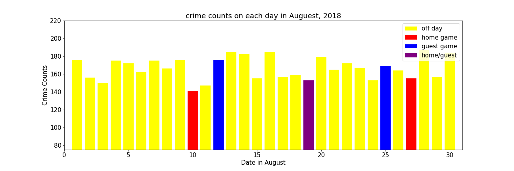
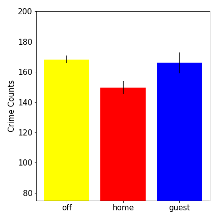
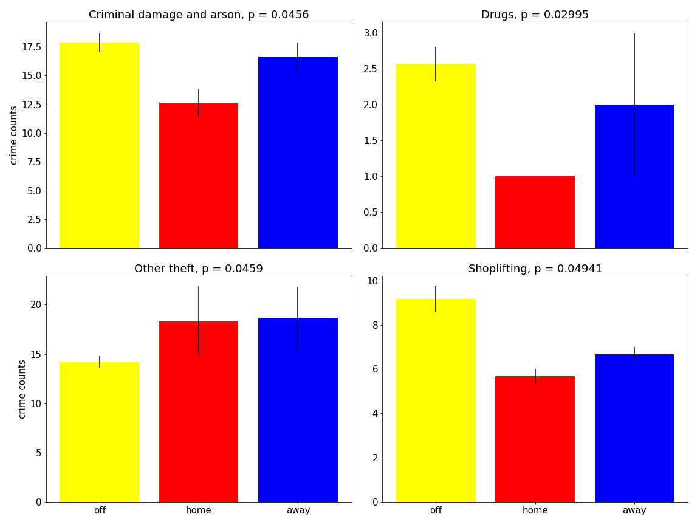
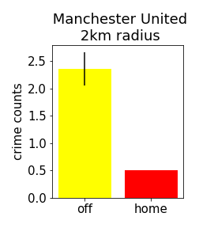
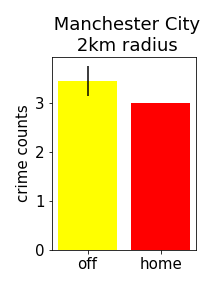
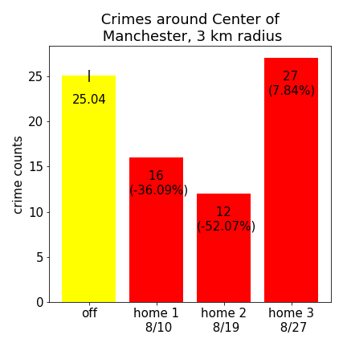

# Project-1---EPL

* Source data
  * Crime data, City of Manchester, UK, August, 2018
    https://www.kaggle.com/pratikbu/great-manchester-crime
  * Game Data, Premier League 2018-2019 season
    https:/datahub.io//collections/football

* data cleaning
   crime data: turned into Pandas DataFrame from a sql file, 5000 crimes were recorded bewteen Ausust 1 and 30 in 2018
   game data: Manchester_EPL.ipynb

* Analysis
  * Overall crime counts on each day in August 2018
  
    * Home games were held on August 10, 19, and 27
    * Away game were held on August 12, 19 and 25
    * Home game for Manchester City and guest game for Mancehster United on August 19
    * Crimes went down on home game days; however, the only day that crimes went down 
  * Statistics analysis
    * Average crimes on home game (home), away game (away) and no game (off) days
    
      * The average crime on home game days (home) are 11.04% lower tha the crimes happened on the days without games (off)
      * the p-value for average crime on home game (home) and no game (off) days is 0.02766 < 0.05 
      * The p-value for average crime on away game (home) and no game (off) days is 0.780108 > 0.05, suggested that they are not statistically different.
      * We will focus on the difference between home game and off days for further analysis
      * The error bars indicate the stand error

    * Checking all 19 subtypes and find the crime subtypes that are statistically signicantly different betewwn home game (home) and no game (off) days
    
      * Four types of crimes are statistically different between home game (home) and on game (off) days
      * On average, less Criminal and Arson (-29.16%), Drugs (-61.02%), and Shoplifting (-38.14%) on game days 
      * On average, more Other Theft (29.11%) on game day. 
      * The error bars indicate the stand error

  * Analazing the crime data on google maps according to the latitude and longtitude of each crimes
      * We found a lot of crimes commited at the center of the city.
      * Though both stadium are not too far away from the center of the city (about 3 km), there are not a lot of crimes around the statium on both game days and off days (see the heatmaps)
      * We will further analyze the crimes committed at the center of the city, around both stadium on home game days and off days
  
  * Crimes around stadiums and center of city on both home game and no game days
    * Manchster Uniter stadium (Old Trafford)
    
      * Even on off game day, there are not a lot of crimes committed around the stadium (2km range)
      * On home game day, less crimes are committed around the stadium

    * Manchester City stadium (Etihad)
    
      * More game are committed around the Manchester City Stadium then around Manchester United Stadium (2km range)
      * On home game day, the crimes were not going down around the stadium

    * Center of the city of Manchester
    
      * Crime number at the center of the city went down on 8/10 and 8/19, but went up on8/27
      * 8/27/2018 is also a National Holiday for England, so the increase might come from effects of national holiday activities.
      * The lowest crime counts at the center of the city in August was on 8/19, when both home game (for Manchester City) and away game(for Manchester United) were held. 