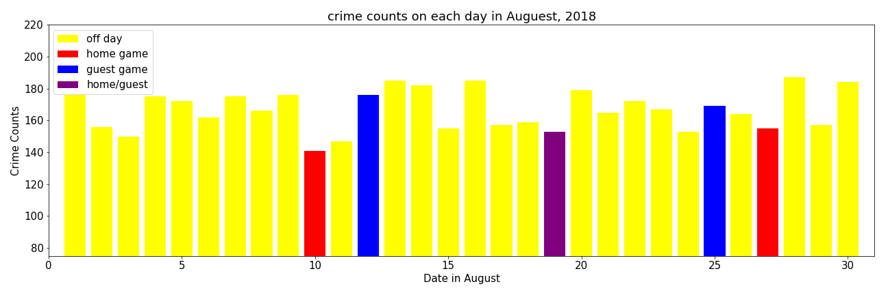
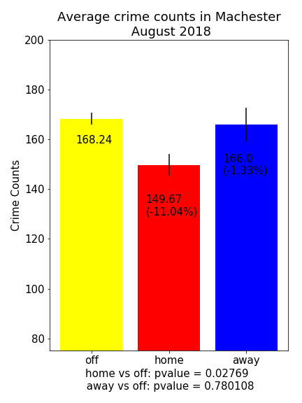
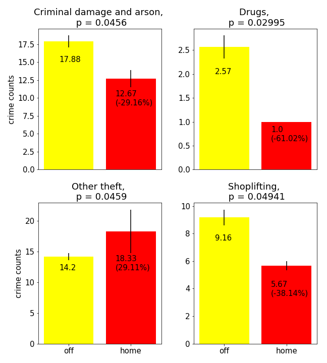
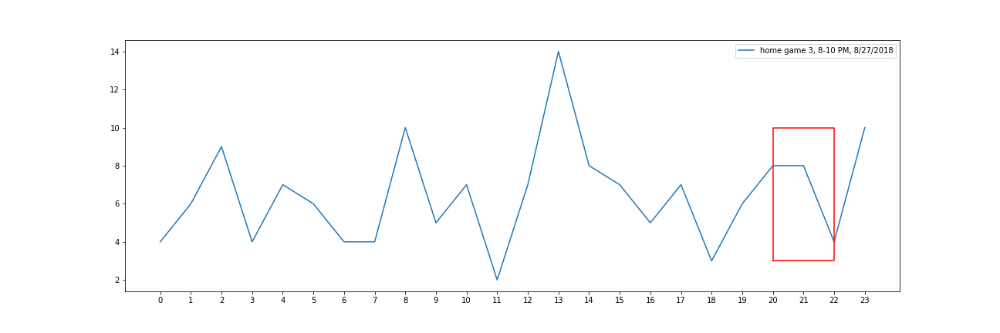

# Project-1---EPL

* Source data
  * Crime data, City of Manchester, UK, August, 2018
    https://www.kaggle.com/pratikbu/great-manchester-crime
  * Game Data, Premier League 2018-2019 season
    https://datahub.io/sports-data/english-premier-league#resource-english-premier-league_zip

* data cleaning
   * crime data: turned into Pandas DataFrame from a sql file, 5000 crimes were recorded bewteen Ausust 1 and 30 in 2018
   * game data: see Manchester_EPL.ipynb for cleaning 

* Analysis
  * Overall crime counts on each day in August 2018
  
    * Home games were held on August 10, 19, and 27
    * Away game were held on August 12, 19 and 25
    * Home game for Manchester City and guest game for Mancehster United on August 19
    * Crimes went down on home game days; however, the only day that crimes went down 
  * Statistics analysis
    * Average crimes on home game (home), away game (away) and no game (off) days
    
      * The average crime on home game days (home) are 11.04% lower tha the crimes happened on the days without games (off)
      * the p-value for average crime on home game (home) and no game (off) days is 0.02766 < 0.05 
      * The p-value for average crime on away game (home) and no game (off) days is 0.780108 > 0.05, suggested that they are not statistically different.
      * We will focus on the difference between home game and off days for further analysis
      * The error bars indicate the stand error

    * Checking all 19 subtypes and find the crime subtypes that are statistically signicantly different betewwn home game (home) and no game (off) days
    
      * Four types of crimes are statistically different between home game (home) and on game (off) days
      * On average, less Criminal and Arson (-29.16%), Drugs (-61.02%), and Shoplifting (-38.14%) on game days 
      * On average, more Other Theft (29.11%) on game day. 
      * The error bars indicate the stand error

  * Analazing the crime data on google maps according to the latitude and longtitude of each crimes
      * We found a lot of crimes commited at the center of the city.
      * Though both stadium are not too far away from the center of the city (about 3 km), there are not a lot of crimes around the statium on both game days and off days (see the heatmaps)
      * We will further analyze the crimes committed at the center of the city, around both stadium on home game days and off days
  
  * Crimes around stadiums and center of city on both home game and no game days
    * Manchster Uniter stadium (Old Trafford)
    
      * Even on off game day, there are not a lot of crimes committed around the stadium (2km range)
      * On home game day, less crimes are committed around the stadium

    * Manchester City stadium (Etihad)
    
      * More game are committed around the Manchester City Stadium then around Manchester United Stadium (2km range)
      * On home game day, the crimes were not going down around the stadium

    * Center of the city of Manchester
    
      * Crime number at the center of the city went down on 8/10 (36.09% decrease) and 8/19 (52.07% decrease), but went up on 8/27(7.84% increase)
      * 8/27/2018 is also a National Holiday in England, so the increase might come from effects of national holiday activities.
      * The lowest crime counts at the center of the city in August was on 8/19, when both home game (for Manchester City) and away game(for Manchester United) were held. 
   * Hourly analysis of crimes on home game days
    
      * We analyzed the hourly crime data on three home game days in August 2019.
      * The figure here is the hourly crime change on one of the home game day. The red box indicates the game time
      * In all three home games we found that the reported crimes went down after the half-time of the game.
      * We also found that the reported crimes went up after the end of the games for all three games.

* Limitation of our analysis:
  1. We can only got the daily crime data for August 2018, which is the first month of the 2018/2019 EPL season. There are only five game days (3 home, 3 away and 1 oerlap) in Manchester in August 2018, So we have limited data for our statitics analysis
  2. 8/27 is also a national holiday in England. And we can not ruled out that the activities on national holiday will also affect the crime rate on that day. 
  3. The hourly data depends on the time when crime were reported, not really the same time that crime occurred.
  4. We have not compared our data with the data from other city, for lacking the daily crime data in othe cities in England. 

* Files in the repository
  * Manchester_EPL.ipynb : Parsing and cleaning the game day data to find games for Manchester teams (Manchester United and Manchester City). Analyzing the crime data on away game days
  * manchester_crime.ipynb: The main program for analyzing crims on game days and no game days. Programs for create charts (csv files) and graphs. 
  * manchester_home_games.ipynb : the analysis on home game days
  * Resources folder: csv files for crime and game data
     * EPL_season_1819.csv: game data for EPL 2018/2019 season
     * final_manchester_crime_data.csv: crime data in August 2018
     * final_manchester_crime_data_off_game.csv: crime data on no game days
     * final_manchester_crime_data_home_game.csv: crime data on home game days
     * final_manchester_crime_data_guest_game.csv: crime data on away game days
  * Images folder: images generating from manchester_crime.ipynb, see the jupyter notebook manchester_crime.ipynb  for details. 